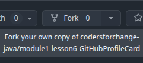
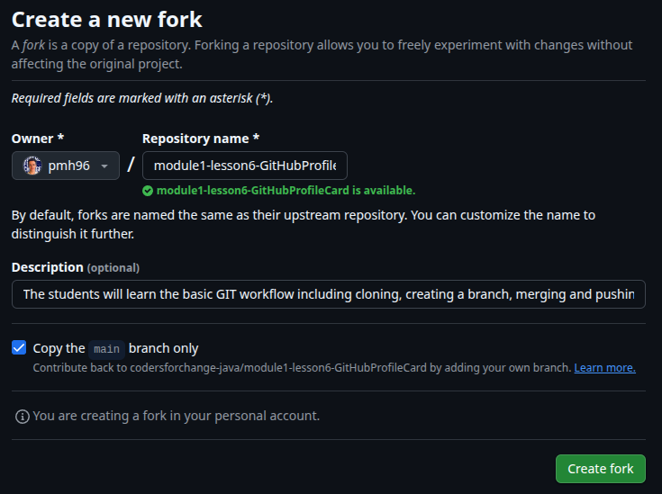
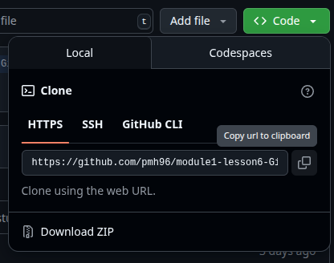
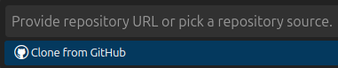
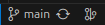
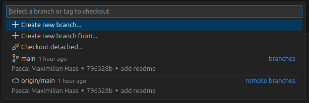
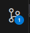
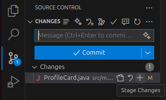
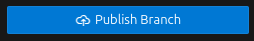
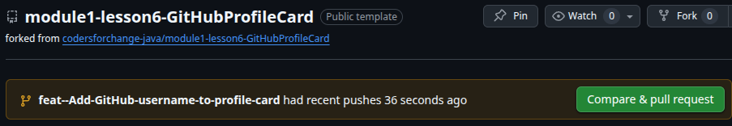

# Module 1 - Lesson 6 - Exercise - My First Git Workflow: The Profile Card

## 📝 Description

Welcome to the exercise! The goal of this exercise is to help you get comfortable with **Git and GitHub workflows**. You will create a simple program that allows you to practice forking, cloning, branching, committing, and creating pull requests on GitHub.

## 🎯 Learning Goal

This exercise will help you practice **Git version control** and **GitHub collaboration** by walking you through the complete workflow of making changes to a project and contributing them back.

---

## 🚀 Instructions

## Exercise 1: My First Fork & Clone

**Goal:** Get your own personal copy of this project on your computer.

1.  **Fork this Repository:** Click the **"Fork"** button in the top-right corner of this page. This creates your own copy of the project on your GitHub account.





Click "Create Fork" and wait for the fork processing to complete.

2.  **Clone Your Fork:**
    * Navigate to **your forked repository** on GitHub (the URL should now have your username).
    * Click the  button and copy the **HTTPS URL**.
  


3. In Visual Studio Code, open the Command Palette, type `Git: Clone`, and press Enter. You can use the shortcut `Ctrl+Shift+P` (Windows) or `Cmd+Shift+P` (Mac) to open the Command Palette. Alternatively you can use the "View" menu and select "Command Palette".

   
4. Paste the URL you copied and choose a location on your computer to save the project.
5. Open the cloned project folder in VS Code. Visual Studio might automatically ask you to open the folder in a new window. Click **"Yes"** to open it in a new window.


---

## Exercise 2: The Feature Branch Workflow

**Goal:** Update your profile card on a safe, separate branch.

---

### 1. Create a New Branch
In the bottom-left corner of VS Code, click on the branch name (it should say `main`). 



From the menu, select **"Create new branch"**. Name your new branch `feature/add-profile-name` and press Enter.



---

### 2. Make a Code Change
 * Open the file: `src/com/codersforchange/profile/ProfileCard.java`.
 * Find the line with the placeholder text `[YOUR GITHUB USERNAME HERE]`.
 * Replace that placeholder text with your actual GitHub username.


### 📂 Project Structure

This project follows a standard Java project structure:

```
src/
  main/
    java/
      com/
        codersforchange/
          profile/
            ProfileCard.java   # The file you'll be modifying
```

---

### 3. Stage & Commit
 * Go to the    **Source Control** panel in VS Code.
 * Click the **plus icon (+)** next to the `ProfileCard.java` file to stage it.



 * In the "Message" box, type a clear commit message like `feat: Add GitHub username to profile card`.
 * Click the **Commit** button to commit your change.

---

## Exercise 3: Pushing and Merging a Pull Request

**Goal:** Publish your updated profile card and merge it.

### 1.  **Push Your Branch:** 

In VS Code, click the **"Publish Branch"** button to upload your new branch and its commit to your GitHub repository.



---

### 2.  **Create a Pull Request (PR):**

Open your browser again and go to your forked repository on GitHub. You should see a banner prompting you to **"Compare & pull request"**. Click it.



---

### 3.  **Merge Your Pull Request:**

* Give your Pull Request a title, like "Update Profile Card".
* Click **"Create pull request"**, and on the next screen, click **"Merge pull request"** and confirm.

---

### 🥳 Congratulations! 
You have personalized your profile card and completed the fundamental workflow used by developers every day!**

---

## ❗️ Important - Do not worry, if you get stuck or need help!

Making mistakes and getting stuck sometimes is absolutely normal and part of the process! 

👇 Should you not be able to solve the issue on your own, do not hesitate to reach out for help in our Slack channel! 👇

<TODO - Link to Slack Channel>