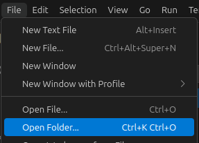
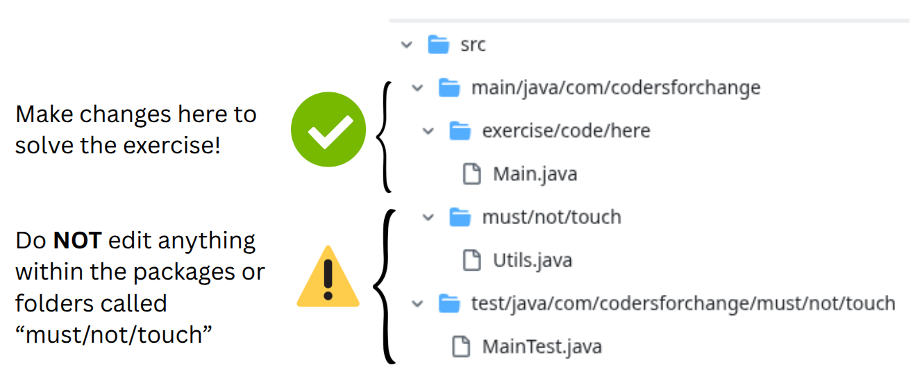

# Exercise: [Exercise Name]

## 📝 Description

Welcome to the exercise! The goal of this exercise is to help you get comfortable with **[main programming concepts involved]**. You will create a simple program that **[brief, one-sentence description of the exercise]**.

## 🎯 Learning Goal

This exercise will help you practice **[specific programming skill #1]** and **[specific programming skill #2]**.

---

## 🚀 Instructions

### 1. Open Visual Studio Code
Launch your Visual Studio Code editor.

### 2. Open the Project Folder
In the VS Code top menu, go to **File > Open Folder...** and select the folder of this exercise that you just unzipped.

This will open the entire project in VS Code, and you're ready to start working!

---

## 📂 Project Structure and Your Task

Inside the project, you will find two main packages/directories in the `src` folder:

* `[com.codersforchange.exercise.code.here]`: This is where you will write your code. You are expected to modify the files within this package to complete the exercise.
* `[com.codersforchange.must.not.touch]`: ⚠️ **IMPORTANT!** You must **not** edit any files inside this package. These files are used to test your code, and any changes will cause the tests to fail!

Note: This image is just an example of how the project structure could look like. The actual project structure may be different!

### ❔ Your Task:

Navigate to the `[FileName.extension]` file inside the `[com.codersforchange.exercise.code.here]` package. Inside this file, you will need to:

1.  **[Step 1: Describe the first specific action the student needs to take].**
2.  **[Step 2: Describe the second specific action].**
3.  **[Step 3: Describe the third specific action].**
4.  ...and so on.

---

## 🚀 Running the Program

TODO: Explain how to run the program using the play button at the main method in VSC

---

## ✅ Testing Your Work Locally

Before you consider the exercise complete, you should run the provided unit tests to see if your code works as expected.

In your IDE's file explorer, find the `[MainTest.java]` file within the `src/test/java/com/codersforchange/must/not/touch` folder. You should see a small "run" icon next to the test methods or the class name itself. Click it to execute the tests.

* **✅ If all tests pass (you see green checkmarks), congratulations! You are on the right track.**
* **❌ If any tests fail (you see red crosses), the output in the terminal will give you clues as to what might be wrong. Review the exercise requirements and your code, fix the issues, and run the tests again.**

---

## ❗️ Important - Do not worry, if you get stuck or need help!

Making mistakes and getting stuck sometimes is absolutely normal and part of the process! 

👇 Should you not be able to solve the issue on your own, do not hesitate to reach out for help in our Slack channel! 👇

<TODO - Link to Slack Channel>
